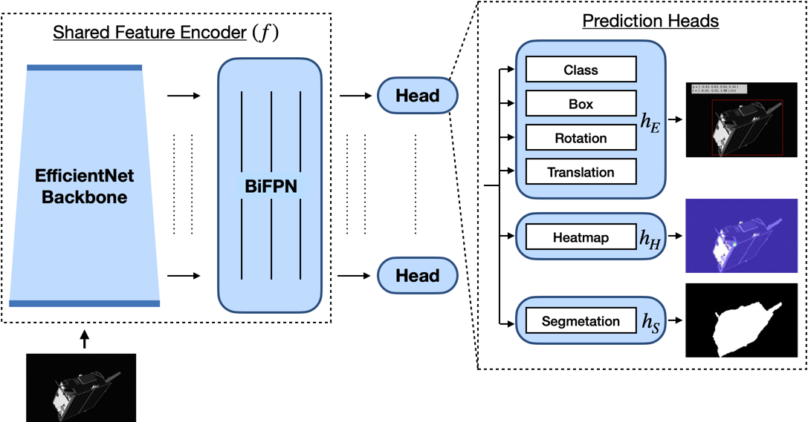

# SPNv2: Robust Multi-task Learning and Online Refinement for Spacecraft Pose Estimation across Domain Gap

This repository is developed by Tae Ha "Jeff" Park at [Space Rendezvous Laboratory (SLAB)](slab.stanford.edu) of Stanford University.

## Introduction

This is the official PyTorch implementation of [SPNv2](https://arxiv.org/abs/2203.04275).

### Abstract

This work presents Spacecraft Pose Network v2 (SPNv2), a Convolutional Neural Network (CNN) for pose estimation of noncooperative spacecraft across domain gap. SPNv2 is a multi-scale, multi-task CNN which consists of a shared multi-scale feature encoder and multiple prediction heads that perform different tasks on a shared feature output. These tasks are all related to detection and pose estimation of a target spacecraft from an image, such as prediction of pre-defined satellite keypoints, direct pose regression, and binary segmentation of the satellite foreground. It is shown that by jointly training on different yet related tasks with extensive data augmentations on synthetic images only, the shared encoder learns features that are common across image domains that have fundamentally different visual characteristics compared to synthetic images. This work also introduces Online Domain Refinement (ODR) which refines the parameters of the normalization layers of SPNv2 on the target domain images online at deployment. Specifically, ODR performs self-supervised entropy minimization of the predicted satellite foreground, thereby improving the CNN’s performance on the target domain images without their pose labels and with minimal computational efforts.



## Main Results

### Offline Training of Full Configuration SPNv2 on SPEED+ HIL Domains and PRISMA25

|       | lightbox |       |       | sunlamp |       |       | prisma25 |     |
| :---: |  :---:   | :---: | :---: |  :---:  | :---: | :---: |  :---:  | :---: |
| E_T [m] | E_R [deg] | E_pose | E_T [m] | E_R [deg] | E_pose | E_T [m] | E_R [deg] | E_pose |
| 0.175 | 6.479 | 0.142 | 0.225 | 11.065 | 0.230 | 1.572 | 5.202 | 0.216 |

### ODR (B = 4, N = 1024) on SPEED+ HIL Domains

|       | lightbox |       |       | sunlamp |       |
| :---: |   :---:  | :---: | :---: |  :---:  | :---: |
| E_T [m] | E_R [deg] | E_pose | E_T [m] | E_R [deg] | E_pose |
| 0.142 | 5.624 | 0.122 | 0.182 | 9.601 | 0.198 |

## Installation

The code is developed and tested with python 3.7 and PyTorch 1.10 on Ubuntu 20.04. The offline training is tested on 4 NVIDIA V100 GPUs, whereas ODR is tested on a single NVIDIA GeForce RTX 2080 Ti 12GB GPU.

1. Install [PyTorch](https://pytorch.org/).

2. Clone this repository at `$ROOT`.

3. Install dependencies.

```
pip3 install -r requirements.txt
```

4. Download [SPEED+](https://purl.stanford.edu/wv398fc4383) at `$DATASET.ROOT`.

5. (Optional) Download pre-trained models from [here](https://office365stanford-my.sharepoint.com/:f:/g/personal/tpark94_stanford_edu/EleRJUfWcTdComwfLwrrGTIBfj1xNahq06_NiNDDKUDFJg?e=s0qDch). Specify the model's path at `${TEST.MODEL_FILE}`.

## Currently Unavailable Items

The following items are currently unavailable:

- `.mat` file containing Tango keypoints
- binary masks
- `lightbox` and `sunlamp` labels

For now, in order to prepare `.csv` files for the labels, you must recover 11 keypoints of Tango following the procedure described in this [paper](https://arxiv.org/abs/1909.00392) or any method of your choice. Save them as a 3 x 11 array in meters under the variable named `tango3Dpoints` as a `.mat` file. Specify its path w.r.t. `$DATASET.ROOT` at `$DATASET.KEYPOINTS`.

## Pre-processing

To pre-process the training labels for the `synthetic` domain, run
```
python3 tools/preprocess.py --jsonfile synthetic/train.json --cfg experiments/offline_train_full_config.yaml
```

In addition to the `.csv` files under `labels`, it will save the resized images to `images_768x512_RGB`, for example. Currently, only `synthetic/train.json` and `synthetic/validation.json` are supported for processing. Include `--no_masks` to ignore masks and use keypoints to construct bounding boxes instead. Run the above with `--no_labels` to prepare list of `lightbox` and `sunlamp` images without labels.

### Style Augmentation

The images can be stylized using the code from this [repository](https://github.com/philipjackson/style-augmentation). We will release the style-augmented images of SPEED+ in the future as well.

## Training & Testing

To train the full configuration SPNv2 on SPEED+ `synthetic` data on multiple GPUs:
```
python3 tools/train.py --cfg experiments/offline_train_full_config.yaml
```

To train on a single GPU, add `--DIST.MULTIPROCESSING_DISTRIBUTED False`. To train without binary masks, you must modify the `MODEL` configuration to the following:
```
HEAD:
    NAMES: ['heatmap', 'efficientpose']
    LOSS_HEADS: ['heatmap', 'efficientpose']
    LOSS_FACTORS: [1.0, 1.0]
    LOSS_NUMS: [1, 3]
```
This will skip building the Segmentation head altogether.

To test the trained model:
```
python3 tools/test.py --cfg experiments/offline_train_full_config.yaml
```
By default, it fetches the trained model from `${OUTPUT_DIR}/${MODEL.BACKBONE.NAME}/${EXP_NAME}/model_best.pth.tar`. In order to test other trained models, specify its path at `${TEST.MODEL_FILE}`. The testing is only supported for the `synthetic` validation set.

### Training on Sherlock

If you are a Stanford student with access to the [Sherlock](https://www.sherlock.stanford.edu/) cluster, check out the example job scripts at

- `scripts/sherlock_preprocess.sh` for pre-processing, and

- `scripts/sherlock_offline_dist_train.sh` for distributed training.

## Online Domain Refinement (ODR)

To perform ODR, run
```
bash scripts/odr.sh
```

## License

The SPNv2 repository is released under the MIT License (see `LICENSE.md` for more details).

## Citation

```
@article{park2022spnv2,
        title={Robust Multi-Task Learning and Online Refinement for Spacecraft Pose Estimation across Domain Gap},
        author={Park, Tae Ha and D'Amico, Simone},
        journal={arXiv preprint arXiv:2203.04275},
        year={2022}
}
```
